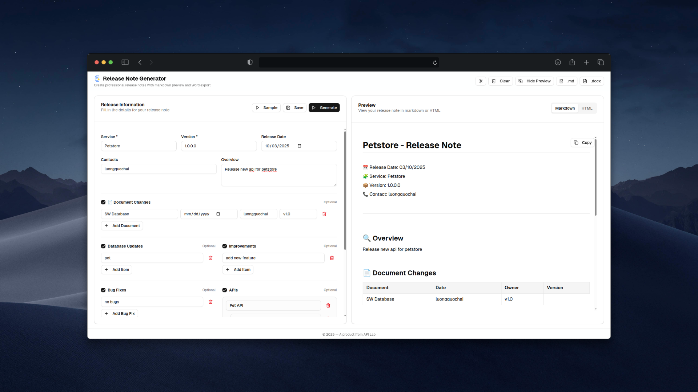

<div align="center">
  <a href="https://s.dpway.io/release-note-generator">
    
  </a>
  <h3>
    <b>
      Release Note Generator
    </b>
  </h3>
  <b>
    Open Source Web Application
  </b>
  <p>

[](CODE_OF_CONDUCT.md) <a href="https://s.dpway.io/release-note-generator"></a> [](https://s.dpway.io/release-note-generator)

  </p>
  <p>
    <sub>
      Built with ❤︎ by
      <a href="https://github.com/luongquochai/release-note-generator/graphs/contributors">
        contributors
      </a>
    </sub>
  </p>
  <br />
  <p>
    <a href="https://s.dpway.io/release-note-generator">
      <picture>
        <source media="(prefers-color-scheme: dark)" srcset="./public/images/image.png">
        <source media="(prefers-color-scheme: light)" srcset="./public/images/image.png">
        
      </picture>
    </a>
  </p>
</div>

A modern web application built with Next.js for generating professional release notes. This tool helps you create well-formatted, consistent release notes for your software projects.

## Features

- **Modern UI**: Built with Next.js 14, React 18, and Tailwind CSS
- **Responsive Design**: Works seamlessly across desktop and mobile devices
- **Rich Text Editor**: Create formatted content with markdown support
- **Dark/Light Theme**: Toggle between themes for better user experience
- **Export Options**: Generate release notes in various formats
- **Component Library**: Uses Radix UI components for accessible design

## Tech Stack

- **Framework**: Next.js 14
- **Language**: TypeScript
- **Styling**: Tailwind CSS
- **UI Components**: Radix UI
- **Icons**: Lucide React
- **Forms**: React Hook Form with Zod validation
- **Package Manager**: pnpm

## Getting Started

### Prerequisites

- Node.js 18+ 
- pnpm (recommended) or npm

### Installation

1. Clone the repository:
```bash
git clone <repository-url>
cd release-note-generator
```

2. Install dependencies:
```bash
pnpm install
# or
npm install
```

3. Run the development server:
```bash
pnpm dev
# or
npm run dev
```

4. Open [http://localhost:3000](http://localhost:3000) in your browser.

## Available Scripts

- `pnpm dev` - Start development server
- `pnpm build` - Build for production
- `pnpm start` - Start production server
- `pnpm lint` - Run ESLint

## Project Structure

```
├── app/                 # Next.js app directory
├── components/          # React components
├── hooks/              # Custom React hooks
├── lib/                # Utility functions
├── public/             # Static assets
├── styles/             # Global styles
└── README.md
```

## Contributing

1. Fork the repository
2. Create your feature branch (`git checkout -b feature/amazing-feature`)
3. Commit your changes (`git commit -m 'Add some amazing feature'`)
4. Push to the branch (`git push origin feature/amazing-feature`)
5. Open a Pull Request


## Authors

This project owes its existence to the collective efforts of all those who contribute — [contribute now](CONTRIBUTING.md).

<div align="center">
  <a href="https://github.com/luongquochai/release-note-generator">
    
  </a>
</div>


## License

This project is licensed under the MIT License - see the [LICENSE](LICENSE) file for details.

## Support

If you have any questions or need help, please open an issue on GitHub.
